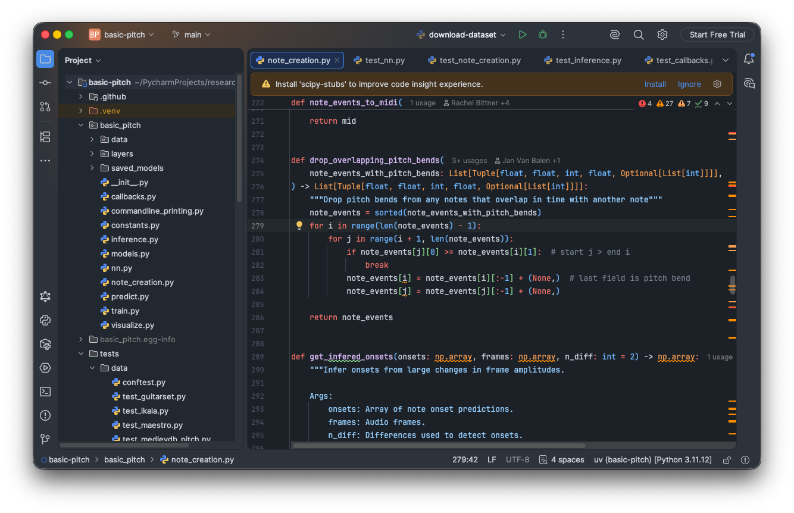
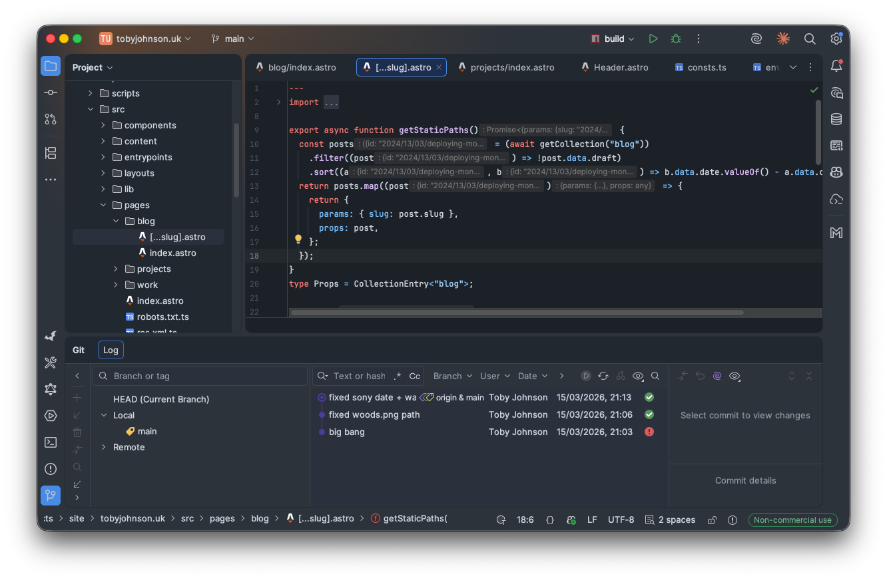

Getting as close to GitHub's Dark Themes as possible.

Installation instructions:
1. Install plugin from JetBrains Marketplace
2. To enable the editor theme, navigate to **Settings -> Editor -> Color Scheme -> Scheme dropdown**
3. Dark theme is applied upon installation by default. To change to Dimmed: navigate to **Settings -> Appearance -> Theme** dropdown
4. Restart IDE for good measure
 
[Intellij Plugin Repository](https://plugins.jetbrains.com/plugin/19291-github-dark) | [Report an issue](https://github.com/toby-j/Intellij_GitHub_Dark_Theme/issues)  

 
# Colour Palette
## Dark
- Red  `#FF7B72`
- Purple  `#DCBDFB`
- Orange  `#FFA657`
- Text-white  `#C9D1D9`
- Blue-light  `#96D0FF`
- Pink  `#F692CE`
- Green  `#8DDB8C`
- Blue-dark  `#6CB6FF`
## Dimmed
- Red  `#FF7B72`
- Purple  `#D2A8FF`
- Orange  `#FFA657`
- Text-white  `#E6EDF3`
- Blue-light  `#A5D6FF`
- Pink  `#F692CE`
- Green  `#8DDB8C`
- Blue-dark  `#79C0FF`

# Contributions

There's plenty more work to do on this plugin, so if you'd like to lend a hand here's how you can.

This is made using DevKit, not Gradle. ([This project might have to migrate this too eventually...](https://plugins.jetbrains.com/docs/intellij/migrating-plugin-devkit-to-gradle.html))

This is the easiest way I found to work on it. For further reading: [here's the official guide](https://plugins.jetbrains.com/docs/intellij/themes-getting-started.html?from=DevkitOpenThemeReference#gradle-based-theme-project)

## Prerequisites 
1. Clone repository on Intellij IDEA Ultimate and open it.
2. Install the plugin "Plugin DevKit" by Intellij
3. Install the latest version of this plugin from the Intellij Marketplace
## Editing
Inside of **resources/themes/** you'll find the `.xml` for the code window and `.json` for everything else (dialog boxes, terminal etc...) for each of the themes.

Working with them requires slightly different approaches.

### .XML
1. Navigate to **Editor -> Color Scheme -> General**
2. Select the theme you wish to edit
3. Make the changes using the GUI.
4. Once you've finished with your edits, export your edited color scheme as an `.icls` (Small cog on the **Editor -> Color Scheme -> General** dialog)
5. With this repository open on Intellij IDEA Ultimate, replace the old `.icls` file with the new one you just exported.

### .JSON
I found the [LaF Defaults tool](https://plugins.jetbrains.com/docs/intellij/internal-ui-laf-defaults.html) useful for editing this.
You can edit the `.json` file and test it out by pressing the play button at the top of the file once you have it open.

## Testing
1. Right click the project window and select "Prepare Plugin Module 'intellijgithub_dark_theme' for Deployment" and save somewhere.
2. You can now load this exported plugin file into any of the Intellij IDEs by navigating to **Settings -> Plugins** pressing the settings cog and selecting "Install Plugin from Disk".

Once you've finished testing and happy with your edits, please feel free to open a pull request! 🚀
