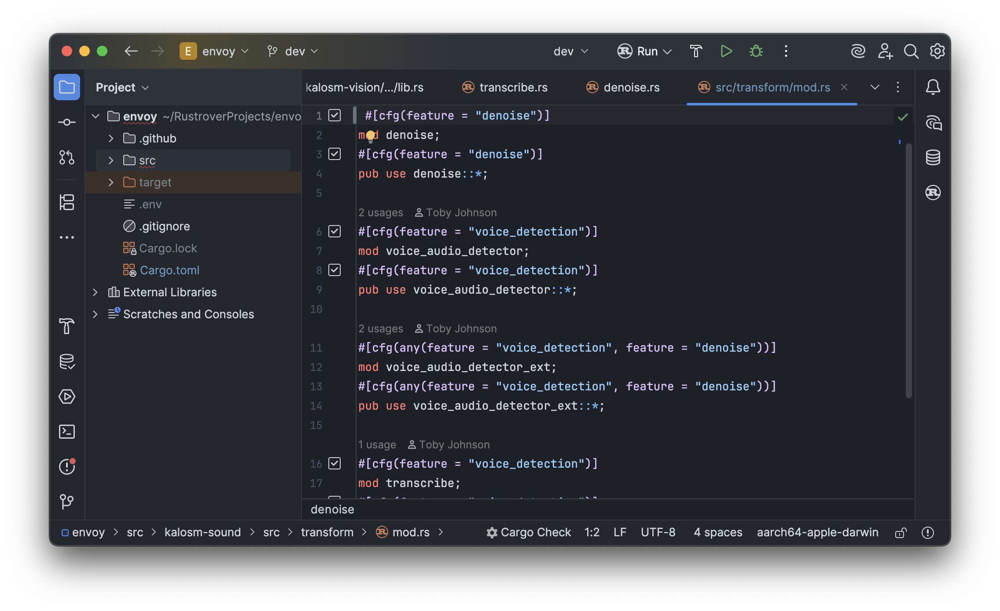
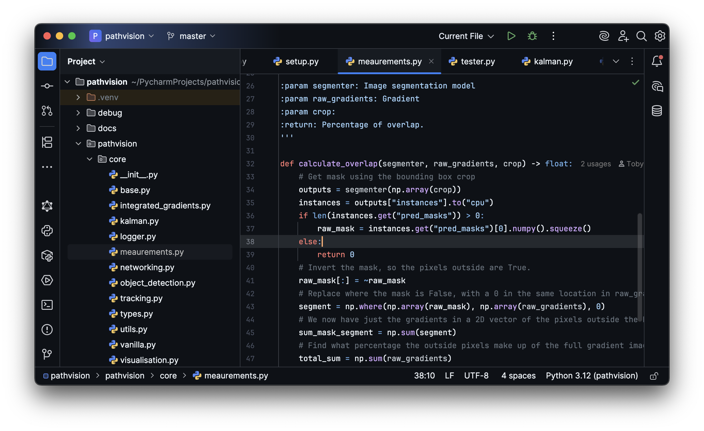

Getting as close to GitHub's dark theme as possible.

Installation instructions:
- Install plugin from JetBrains Marketplace
- To enable the editor theme, navigate to Settings -> Editor -> Color Scheme -> Scheme dropdown
- Dark theme is be applied upon installation by default, to change this navigate to Settings -> Appearance -> Theme dropdown
- Restart IDE for good measure
 
[Intellij Plugin Repository](https://plugins.jetbrains.com/plugin/19291-github-dark) | [Report an issue](https://github.com/toby-j/Intellij_GitHub_Dark_Theme/issues)  

 
# Colour Palette
## Dark
- Red  `#FF7B72`
- Purple  `#DCBDFB`
- Orange  `#FFA657`
- Text-white  `#C9D1D9`
- Blue-light  `#96D0FF`
- Pink  `#F692CE`
- Green  `#8DDB8C`
- Blue-dark  `#6cb6ff`
## Dimmed
- Red  `#ff7b72`
- Purple  `#d2a8ff`
- Orange  `#ffa657`
- Text-white  `#e6edf3`
- Blue-light  `#a5d6ff`
- Pink  `#F692CE`
- Green  `#8DDB8C`
- Blue-dark  `#79c0ff`